# solidity_hw

The purpose of this exercise was to create smart contracts using solidity. This was done using the tools of Metamask, Ganache, and Remix. A mnemonic phrase of choice was used to set up associated etherum wallets to use on the test net. These are the addresses on the local testnet that can receive ETH test transactions and can be viewed in Ganache.

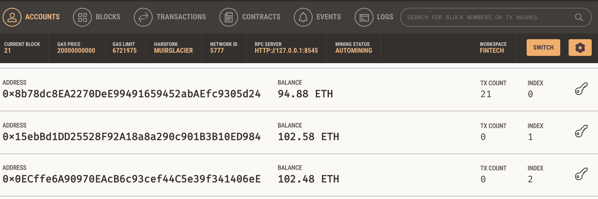

# Metamask
Metamask was required to act as an injected web3 environment host for Remix in order to reject or approve transaction types coming from remix. Metamask was connected to the primary ETH wallet and this wallet was prefunded on the Ropsten network. These ETH can be used to send transactions on the Ropsten testnet.

# Ganache
Ganache is the local ethereum blockchain test network we used for this process. To create the local blockchain testnet a new ethereum workspace was made and various wallet addresses were produced using the chosen mnemonic phrase. It was also specified that each account be prefunded with 100 ETH on the testnet.

# Remix Smart Contracts for Solidity
Remix was the interface used to write, create, deploy, and execute smart contracts on our local network. In this process three types of smart contracts were created for various types of profit splitting or assignment of equity.

## Associate Profit Splitter Smart Contract
The associate profit splitter contract was made to split a transaction deposit equally 3 ways to 3 specified account addresses. When a deposit was made, Metamask was used to confirm the transaction which could then be viewed by seeing the change in balance on the 3 specified wallets in the Ganache local testnet. The following shows the interface of remix, and how the contract was compiled and deployed. It can be seen that in the wallet addresses for a deposit of 1 ETH each wallet recieved 0.33 ETH. Note, prior to this deposit show, several other deposits were made such that the value of wallet 2 and 3 were 102 prior to receiving 1/3 ETH to have a value of 102.33.

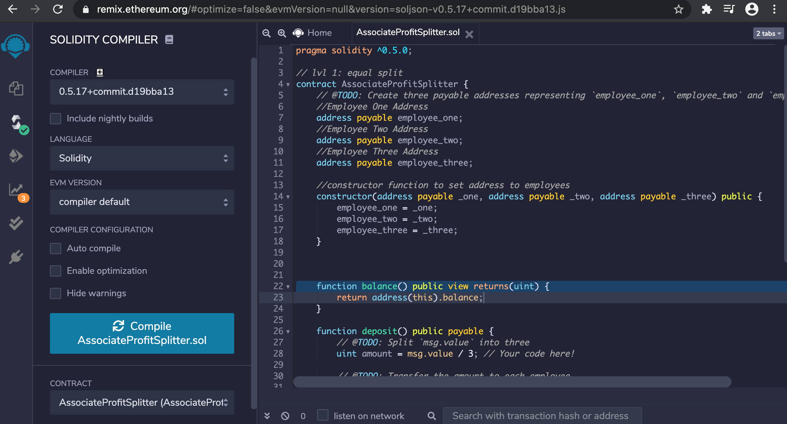

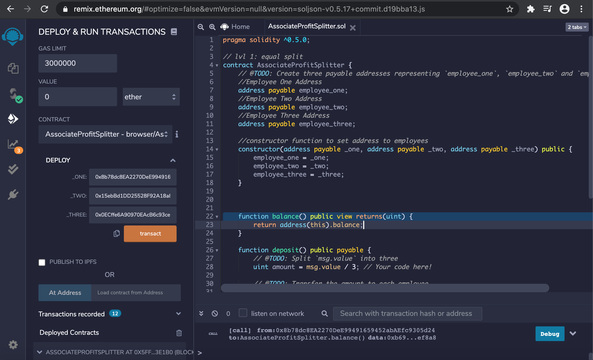

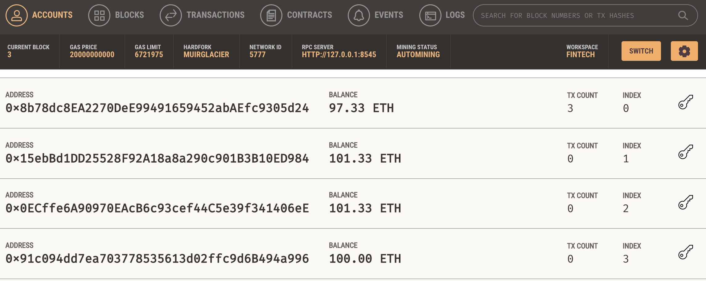

## Tiered Profit Splitter Smart Contract
The tiered profit splitter contract was made to split a transaction deposit to 3 specified account addresses based on percentages representative of their position at the company. Again,when a deposit was made, Metamask was used to confirm the transaction which could then be viewed by seeing the change in balance on the 3 specified wallets in the Ganache local testnet. The following shows the interface of remix, and how the contract was compiled and deployed. It can be seen that in the wallet addresses for a deposit of 1 ETH each wallet 1 received 0.6 ETH, wallet 2 received 0.25 ETH, and wallet 3 received 0.15 ETH. Note, prior to this screenshot of the deposit shown, several other deposits were made such that the starting value of wallet 2 and 3 were 102.33 prior to receiving percentages of the ETH transaction to have a value of 102.58 and 102.48, respectively. Wallet 1 on the other hand started at a value of 95.31. It was the account that provided the 1 ETH to the local testnet for the deposit to be split though so it went from 95.31 to 94.31 before receiving 0.6 ETH to end up at 94.91 ETH. Also note, another gas fee was done to deploy another contract via Metamask before this screenshot so you see a value of 94.90 instead.

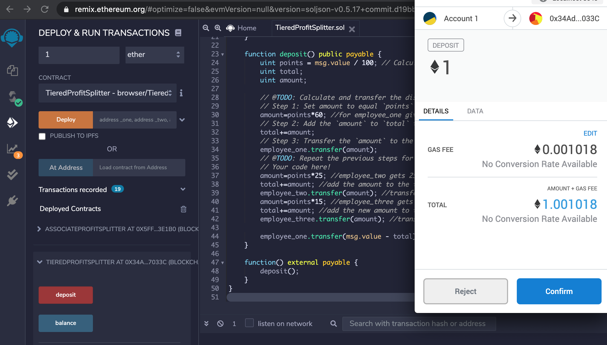

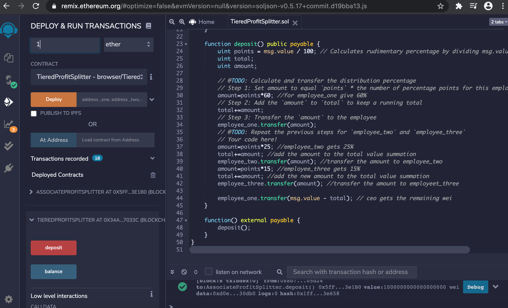

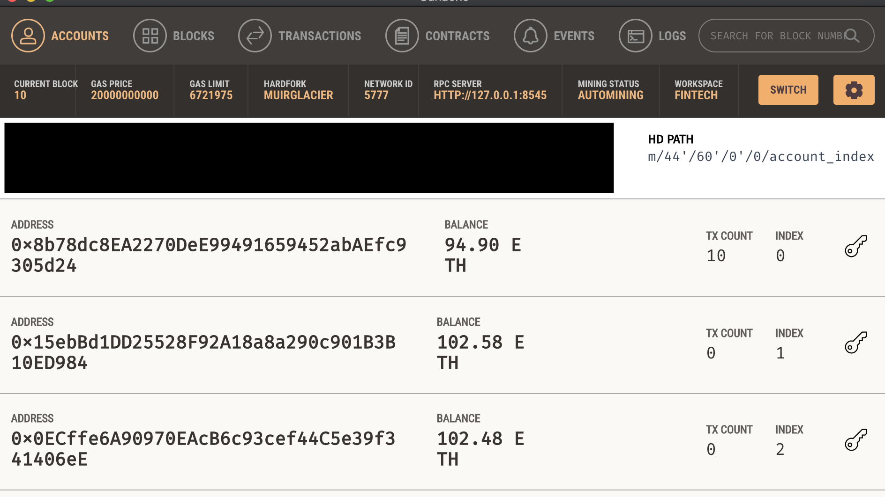

## Deferred Equity Plan Smart Contract
The final smart contract that was deployed to our local testnet on Ganache was one that only distributed 250 shares of equity to an employee account at 1 years time. So when distribute is selected from the deployed contract, the contract will not release any shares unless the unlock time meets the requirements. Testing it on the local testnet required using a fast forward aspect with a fakenow time to step in time and see the shares distributed. The following screenshots show the process of deploying, distributing once allowed to after 4 time steps of 100 days to be in 1 year of employemnet and receive a distribution. Prior to this the transactions were denied and said likely to fail in remix. Another year was stepped through in time with the fast forward and we can see another 250 shares distrubted to the employee account specified. So as we can see the contract executes properly and the employee receives 250 shares after time of 1 year and has received a total sum distributed of 500 shares at 2 years time.

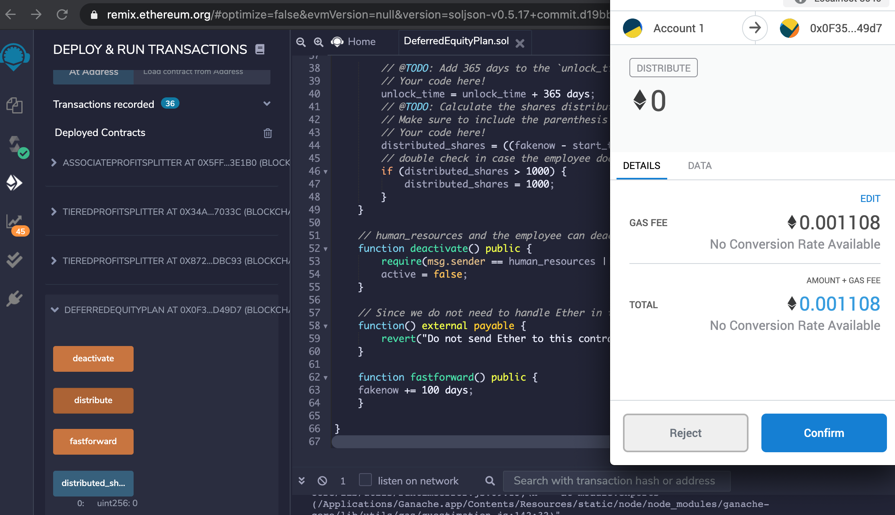

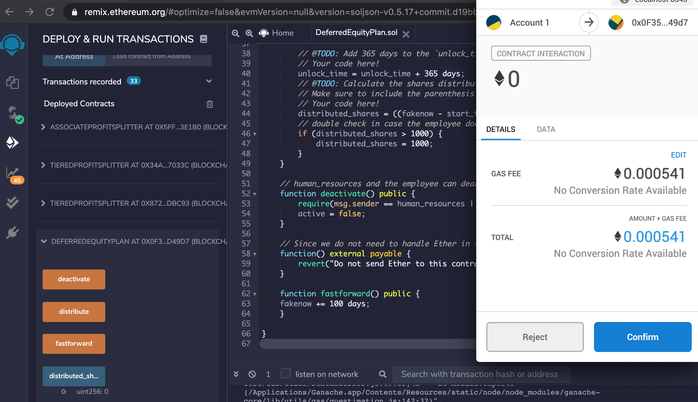

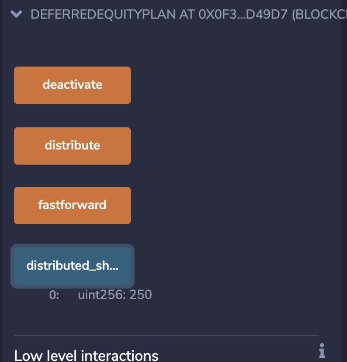

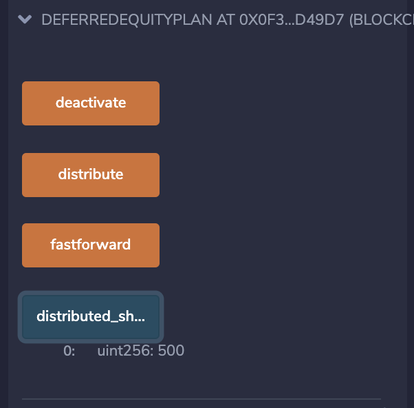

